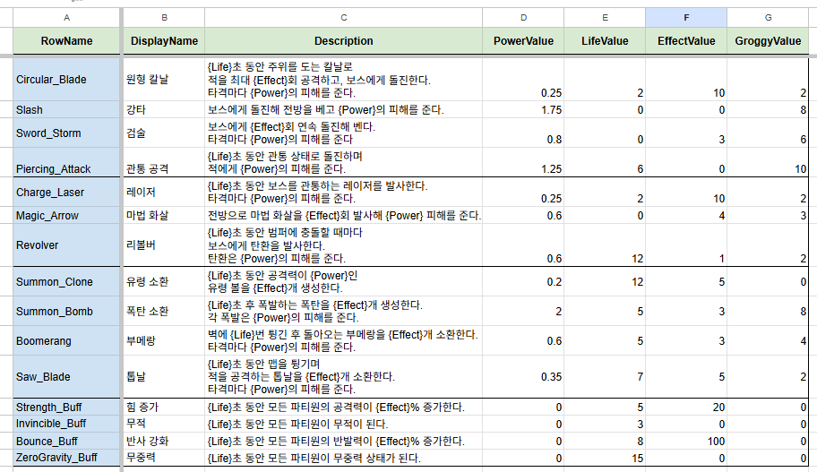
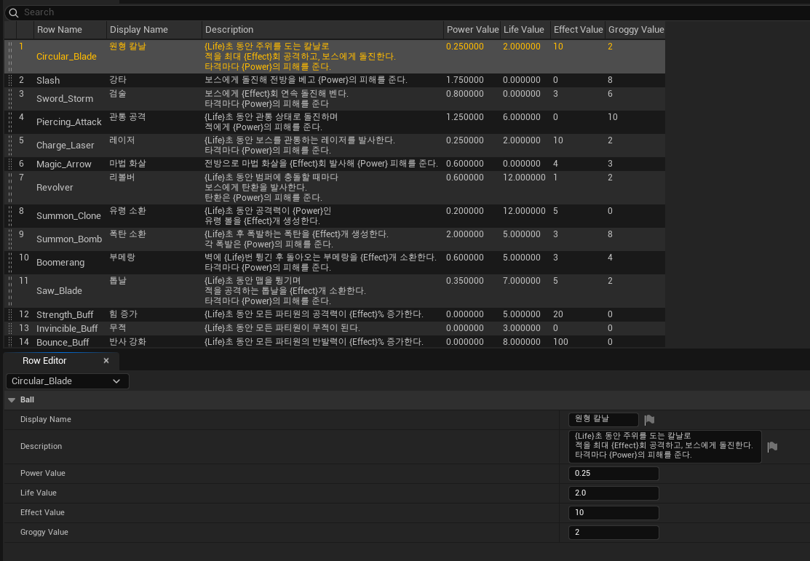
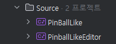
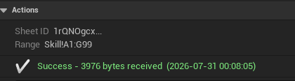
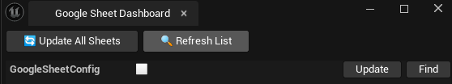

# GoogleSheetLoader 튜토리얼

이 문서는 Google Sheet의 게임 데이터를 Unreal Engine DataTable로 가져오는 가장 기본적인 과정을 설명합니다.

완성되는 흐름은 다음과 같습니다.

```text
데이터 시트 1개
  → GoogleSheetConfig 1개
  → Item Parser 1개
  → Item DataTable 1개
```

## 1. 시트 준비하기

Google Sheet의 첫 행에 Header를 작성합니다.

| RowName | DisplayName | Description | PowerValue | LifeValue | EffectValue | GroggyValue |
|---|---|---|---:|---:|---:|---:|
| Circular_Blade | 원형 칼날 | 칼날로 적을 돌며 공격한다. | 0.25 | 2 | 10 | 2 |
| Slash | 강타 | 보스에게 돌진해 큰 피해를 준다. | 1.75 | 0 | 0 | 8 |
| Sword_Storm | 검술 | 보스에게 연속 돌진해 벤다. | 0.8 | 0 | 3 | 6 |

다음 규칙을 지켜주세요.

- 가져올 범위의 첫 번째 행은 반드시 Header입니다.
- Header는 비워두거나 중복해서 사용할 수 없습니다.
- 하나의 시트 탭은 하나의 DataTable에 연결합니다.
- Parser에서 사용하는 Header 이름과 시트의 대소문자 및 철자를 일치시킵니다.

이 예제에서는 `RowName`을 DataTable의 행 이름으로 사용합니다. `PowerValue`는 소수 값이 있으므로 `float`, 나머지 Value 열은 `int32`로 변환합니다.

시트를 **링크가 있는 사용자가 볼 수 있도록** 설정한 뒤, 가져올 탭을 연 상태에서 브라우저의 전체 URL을 복사합니다. 플러그인이 URL의 `gid`를 읽어 현재 탭을 찾습니다.



## 2. 플러그인 설치하기

플러그인을 프로젝트에 배치합니다.

```text
YourProject/
  Plugins/
    GoogleSheetLoader/
      GoogleSheetLoader.uplugin
```

프로젝트를 다시 열어 플러그인을 활성화하고, C++ 프로젝트 파일을 재생성한 뒤 빌드합니다.

## 3. DataTable Row 구조체 만들기

런타임 모듈에 시트의 한 행을 표현할 구조체를 만듭니다.

```cpp
#pragma once

#include "CoreMinimal.h"
#include "Engine/DataTable.h"
#include "ItemTableRow.generated.h"

USTRUCT(BlueprintType)
struct YOURPROJECT_API FItemTableRow : public FTableRowBase
{
    GENERATED_BODY()

    UPROPERTY(EditAnywhere, BlueprintReadWrite)
    FName RowName = NAME_None;

    UPROPERTY(EditAnywhere, BlueprintReadWrite)
    FString DisplayName;

    UPROPERTY(EditAnywhere, BlueprintReadWrite)
    FString Description;

    UPROPERTY(EditAnywhere, BlueprintReadWrite)
    float PowerValue = 0.0f;

    UPROPERTY(EditAnywhere, BlueprintReadWrite)
    int32 LifeValue = 0;

    UPROPERTY(EditAnywhere, BlueprintReadWrite)
    int32 EffectValue = 0;

    UPROPERTY(EditAnywhere, BlueprintReadWrite)
    int32 GroggyValue = 0;
};
```

컴파일 후 Content Browser에서 이 구조체를 Row Structure로 사용하는 DataTable을 생성합니다.



## 4. Editor Module 준비하기

Parser는 에디터에서만 데이터를 생성·수정하므로 프로젝트의 Editor Module에 작성합니다. 이미 Editor Module이 있다면 이 단계는 건너뛰면 됩니다.

예시 구조:

```text
Source/
  YourProject/
    YourProject.Build.cs
  YourProjectEditor/
    YourProjectEditor.Build.cs
    Private/
      YourProjectEditor.cpp
      ItemDataParser.cpp
    Public/
      ItemDataParser.h
```

아래 예제의 `YourProject`, `YOURPROJECT_API`, `YOURPROJECTEDITOR_API`는 실제 프로젝트와 모듈 이름에 맞게 바꿔야 합니다.

`YourProjectEditor.Build.cs`에 프로젝트 런타임 모듈과 `GoogleSheetLoader`를 추가합니다.

```csharp
using UnrealBuildTool;

public class YourProjectEditor : ModuleRules
{
    public YourProjectEditor(ReadOnlyTargetRules Target) : base(Target)
    {
        PCHUsage = PCHUsageMode.UseExplicitOrSharedPCHs;

        PublicDependencyModuleNames.AddRange(new[]
        {
            "Core",
            "YourProject",
            "GoogleSheetLoader"
        });

        PrivateDependencyModuleNames.AddRange(new[]
        {
            "CoreUObject",
            "Engine",
            "UnrealEd"
        });
    }
}
```

모듈 시작 파일은 다음과 같이 구성할 수 있습니다.

```cpp
#include "Modules/ModuleManager.h"

class FYourProjectEditorModule : public IModuleInterface
{
};

IMPLEMENT_MODULE(FYourProjectEditorModule, YourProjectEditor)
```

마지막으로 `.uproject`의 `Modules` 배열에 Editor Module을 등록합니다.

```json
{
  "Name": "YourProjectEditor",
  "Type": "Editor",
  "LoadingPhase": "PostEngineInit"
}
```

> [!NOTE]
> 위 객체는 기존 `Modules` 배열에 추가하는 항목입니다. `.uproject` 전체를 이 내용으로 덮어쓰면 안 됩니다.



## 5. Parser 만들기

Editor Module에 `UGoogleSheetParserBase`를 상속한 클래스를 만듭니다.

### ItemDataParser.h

```cpp
#pragma once

#include "CoreMinimal.h"
#include "GoogleSheetParserBase.h"
#include "ItemDataParser.generated.h"

class UDataTable;

UCLASS(EditInlineNew)
class YOURPROJECTEDITOR_API UItemDataParser : public UGoogleSheetParserBase
{
    GENERATED_BODY()

public:
    UPROPERTY(EditAnywhere, Category = "Output")
    TObjectPtr<UDataTable> TargetTable;

protected:
    virtual bool OnParseComplete(FString& OutError) override;
};
```

### ItemDataParser.cpp

```cpp
#include "ItemDataParser.h"

#include "ItemTableRow.h"
#include "Parser/SheetDataTableUtils.h"
#include "Parser/SheetParserUtils.h"
#include "Parser/SheetValidation.h"

namespace ItemColumns
{
    const FString RowName = TEXT("RowName");
    const FString DisplayName = TEXT("DisplayName");
    const FString Description = TEXT("Description");
    const FString PowerValue = TEXT("PowerValue");
    const FString LifeValue = TEXT("LifeValue");
    const FString EffectValue = TEXT("EffectValue");
    const FString GroggyValue = TEXT("GroggyValue");

    const TArray<FString> RequiredHeaders =
    {
        RowName,
        DisplayName,
        Description,
        PowerValue,
        LifeValue,
        EffectValue,
        GroggyValue
    };
}

bool UItemDataParser::OnParseComplete(FString& OutError)
{
    using namespace SheetDataTableUtils;
    using namespace SheetParserUtils;
    using namespace SheetValidation;

    static constexpr const TCHAR* ParserName = TEXT("ItemData");
    FParseReport Report;
    OutError.Reset();

    if (!ValidateTargetTable(
            ParserName,
            TargetTable,
            FItemTableRow::StaticStruct(),
            OutError))
    {
        return false;
    }

    ValidateRequiredHeaders(GetHeaders(), ItemColumns::RequiredHeaders, &Report);
    if (Report.HasErrors())
    {
        return FinalizeParseReport(ParserName, Report, OutError);
    }

    FScopedDataTableEditNotification TableEdit(TargetTable);

    for (int32 Index = 0; Index < GetRowCount(); ++Index)
    {
        TMap<FString, FString> RowData;
        if (!GetRowAt(Index, RowData))
        {
            continue;
        }

        FSheetRowReader Row(RowData, Index, Report);
        FItemTableRow NewRow;

        NewRow.RowName = Row.GetRequiredName(ItemColumns::RowName);
        NewRow.DisplayName = Row.Get(ItemColumns::DisplayName);
        NewRow.Description = Row.Get(ItemColumns::Description);
        NewRow.PowerValue = ParseFloatValue(
            Row.GetRequiredString(ItemColumns::PowerValue),
            0.0f);
        NewRow.LifeValue = Row.GetRequiredInt(ItemColumns::LifeValue);
        NewRow.EffectValue = Row.GetRequiredInt(ItemColumns::EffectValue);
        NewRow.GroggyValue = Row.GetRequiredInt(ItemColumns::GroggyValue);

        if (!Row.IsValid())
        {
            continue;
        }

        TargetTable->AddRow(NewRow.RowName, NewRow);
        Report.AddSuccess();
    }

    return FinalizeParseReport(ParserName, Report, OutError);
}
```

이 예제에서 시트의 `RowName`은 구조체 값이면서 DataTable의 실제 행 이름으로도 사용됩니다. `FScopedDataTableEditNotification`은 기본적으로 기존 행을 비우고 새 데이터로 교체하므로, 한 DataTable에 여러 시트를 섞지 않는 것이 중요합니다.

프로젝트를 빌드하고 에디터를 다시 열어 Parser 클래스가 표시되는지 확인합니다.

## 6. GoogleSheetConfig 만들기

Content Browser에서 Data Asset을 생성하고 `GoogleSheetConfig` 클래스를 선택합니다. Config에서 다음 값을 설정합니다.

| 항목 | 설정값 |
|---|---|
| Sheet URL | 가져올 탭을 연 상태에서 복사한 전체 Google Sheet URL |
| Range From | 예: `A1` |
| Range To | 예: `G100` |
| Data Parser | 앞에서 만든 `ItemDataParser` |
| Target Table | 앞에서 만든 Item DataTable |
| Auto Save On Complete | 완료 후 에셋을 자동 저장하려면 활성화 |
| Save Normalized Json | 변환 결과를 확인하거나 디버깅하려면 활성화 |

범위는 첫 행에 Header가 포함되도록 지정해야 합니다. 사진의 시트는 A열부터 G열까지 사용하므로 `A1:G100`처럼 설정합니다.


## 7. 데이터 불러오기

Config Details의 **Load Google Sheet Data** 버튼을 누릅니다.

정상적으로 완료되면 다음 내용을 확인합니다.

- Config의 상태 메시지가 성공으로 표시되는지
- DataTable에 `Circular_Blade`, `Slash`, `Sword_Storm` 등의 행이 생성되었는지
- 한글과 영문 문자열이 원본대로 들어왔는지
- `PowerValue`의 소수와 나머지 Value 열의 정수가 올바르게 변환되었는지



여러 Config를 한 번에 갱신하려면 에디터 툴바의 **Sheet Loader**를 열고 **Update All Sheets**를 사용합니다.



## 8. DataAsset이나 리소스 연결하기

DataTable만 갱신하는 기본 과정이 끝난 뒤에는 Parser에서 다음 기능을 추가할 수 있습니다.

- `GetOrCreateDataAsset`으로 행별 DataAsset 생성 또는 재사용
- `AssignOptionalAsset`으로 경로와 이름 규칙에 맞는 에셋 연결
- `ParseBoolValue`, `ParseFloatValue`, `ParseEnumValue` 등으로 타입 변환
- 배열, 색상, 벡터, 회전 및 Transform 값 변환

공통 변환 및 검증 기능은 플러그인의 다음 헤더에서 확인할 수 있습니다.

- `Plugins/GoogleSheetLoader/Source/GoogleSheetLoader/Public/Parser/SheetParserUtils.h`
- `Plugins/GoogleSheetLoader/Source/GoogleSheetLoader/Public/Parser/SheetValidation.h`

문제가 발생하면 [오류 및 문제 해결](Troubleshooting.md)을 확인하세요.
