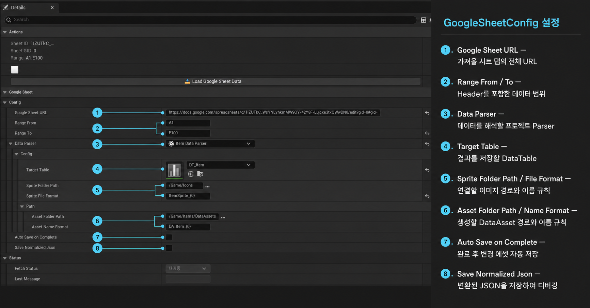

# GoogleSheetLoader

Google Sheet의 데이터를 Unreal Engine `DataTable`로 가져오는 에디터 플러그인입니다.
반복해서 CSV를 내려받지 않고, Config 에셋의 버튼이나 대시보드에서 시트 데이터를 갱신할 수 있습니다.

> [!IMPORTANT]
> 이 플러그인은 다음 세 가지 규칙을 기준으로 사용합니다.
>
> 1. **시트 하나당 DataTable 하나**를 연결합니다.
> 2. 지정한 범위의 **첫 번째 행을 Header**로 사용합니다.
> 3. Parser는 반드시 **`Type: Editor`로 등록된 Editor Module**에 작성합니다. Runtime Module에 작성하지 않습니다.

## 빠른 시작

1. [플러그인을 다운로드](https://drive.google.com/file/d/1d0FCVk4rXKJ08e6issxmvQ8V_Ai6E59F/view?usp=sharing)하여 프로젝트의 `Plugins/GoogleSheetLoader`에 배치합니다.
2. Google Sheet를 링크로 접근할 수 있게 설정하고, 가져올 탭을 연 상태에서 전체 URL을 복사합니다.
3. 시트 Header와 대응하는 `FTableRowBase` 구조체 및 DataTable을 만듭니다.
4. 프로젝트에 **Editor 타입 모듈**을 만들고, 그 안에 `UGoogleSheetParserBase`를 상속한 Parser를 작성합니다.
5. `GoogleSheetConfig` 에셋에 URL, 범위, Parser, 대상 DataTable을 지정합니다.
6. **Load Google Sheet Data**를 눌러 갱신합니다.

> [!WARNING]
> **Parser를 작성하는 모듈은 반드시 Editor Module이어야 합니다.**
>
> `.uproject`의 `Modules` 배열에 아래처럼 `"Type": "Editor"`로 등록된 별도 모듈을 사용하세요.
>
> ```json
> {
>   "Name": "YourProjectEditor",
>   "Type": "Editor",
>   "LoadingPhase": "PostEngineInit"
> }
> ```
>
> Parser 파일은 `Source/YourProjectEditor` 아래에 작성합니다. 게임 실행에 포함되는 Runtime Module인 `Source/YourProject`에는 Parser를 두지 않습니다. 자세한 생성 방법은 [튜토리얼의 Editor Module 준비하기](Docs/Tutorial.md#4-editor-module-준비하기)를 참고하세요.



## 문서

- [처음부터 따라 하는 튜토리얼](Docs/Tutorial.md)

## 데이터 흐름

```text
Google Sheet
  → TSV 다운로드
  → 지정 범위 자르기
  → 첫 행을 Header로 변환
  → Parser 실행
  → DataTable 및 필요한 에셋 갱신
```

시트 URL의 `gid`로 현재 탭을 구분합니다. 별도의 시트 이름을 입력할 필요는 없습니다.

## 요구 사항

- Unreal Engine 5.x
- Google Sheet의 링크 접근 권한
- C++ 프로젝트
- **`Type: Editor`로 등록된 프로젝트 Editor Module**

샘플 프로젝트는 Unreal Engine 5.7을 기준으로 구성되어 있습니다.
